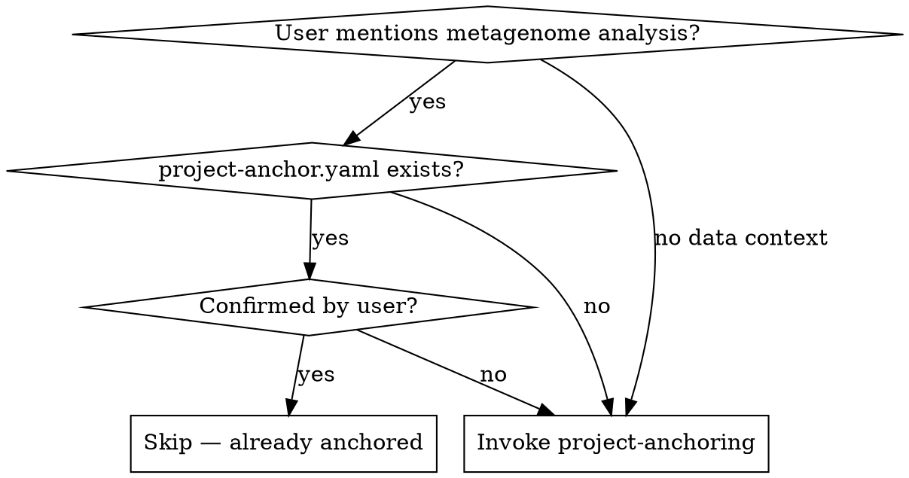

<HARD-GATE>
Do NOT proceed to any other analysis skill until data type, analysis goals, and expert persona are identified and confirmed by the user.
</HARD-GATE>

# Project Anchoring (Phase 0)

## Overview

Bind the correct data type, analysis goals, and domain expertise before any analysis work begins. Wrong data type classification produces irrelevant tool chains, wasted computation, and invalid results.

## When to Use

## Step 1: Identify Data Type

Determine the sequencing data type. This is the MOST CRITICAL classification — it determines the entire downstream tool chain.

| Type | Data Source | Typical Files | Key Tools |
|------|-----------|---------------|-----------|
| **A** — Amplicon | 16S/18S/ITS rRNA gene sequencing | Paired-end FASTQ (e.g., V3-V4 region) | DADA2, QIIME2, PICRUSt2 |
| **M** — Metagenome (Assembly) | Shotgun whole-genome sequencing | Paired-end FASTQ, deep sequencing | MEGAHIT, Prodigal, MetaBAT2, eggNOG |
| **R** — Metagenome (Read-Based) | Shotgun whole-genome sequencing | Paired-end FASTQ | MetaPhlAn3/4, HUMAnN2/3, Kraken2 |
| **C** — Combined | Both amplicon + shotgun | Multiple FASTQ sets | Cross-validated pipeline |

If data type is ambiguous, MUST ask clarifying questions:
- "Is this amplicon (16S/ITS) or shotgun metagenome data?"
- "What is the target region (V3-V4, V4, ITS1, etc.)?"
- "What is the sequencing depth per sample?"
- "Do you prefer assembly-based or read-based metagenome analysis?"

Do NOT guess. Wrong classification wastes the entire project.

## Step 2: Gather Sample Information

Collect essential sample metadata:

1. **Total sample count** — How many samples?
2. **Group structure** — What are the experimental groups? (e.g., control vs disease)
3. **Group sizes** — How many samples per group? (warn if <3 per group)
4. **Metadata availability** — Is clinical/environmental metadata available?
5. **Sequencing platform** — Illumina MiSeq/NovaSeq, PacBio, Nanopore?
6. **Read length** — Paired-end 2x250bp, 2x150bp, etc.

<IRON-LAW>
If any group has fewer than 3 biological replicates, WARN the user immediately:
"Group [X] has only [N] samples. Statistical analyses (diversity, differential abundance) require a MINIMUM of 3 biological replicates per group. Results with <3 replicates cannot support statistical claims."
</IRON-LAW>

## Step 3: Define Analysis Goals

Ask the user about their primary analysis objectives. Common goals for gut metagenome studies:

| Goal Category | Typical Analyses | Minimum Requirements |
|--------------|-----------------|---------------------|
| Community composition | Taxonomy profiling, abundance barplots | Any data type |
| Diversity comparison | Alpha/beta diversity, PCoA, PERMANOVA | ≥3 samples/group |
| Differential taxa | DESeq2, ANCOM-BC, LEfSe | ≥3 samples/group, groups defined |
| Functional profiling | PICRUSt2 (amplicon), HUMAnN3 (shotgun) | Appropriate data type |
| Interaction networks | SparCC, SpiecEasi co-occurrence | ≥20 samples recommended |
| Biomarker discovery | Random forest, indicator species | ≥10 samples/group recommended |

Record the prioritized list of analysis goals in the anchor file.

## Step 4: Anchor Expert Persona

Bind the correct domain expert identity based on the data and goals:

| Context | Expert Persona |
|---------|---------------|
| 16S gut microbiome | Gut microbiome ecologist with amplicon analysis expertise |
| Shotgun metagenomics | Computational metagenomics specialist |
| Clinical gut study | Clinical microbiome researcher with biostatistics focus |
| Diet/nutrition study | Nutritional microbiome researcher |
| IBD/IBS study | GI disease microbiome specialist |
| Infant gut development | Developmental microbiome researcher |

## Step 5: Preliminary Resource Check

Ask the user about available resources:

**Compute resources:** Linux server / HPC cluster / laptop / cloud
**Storage:** How much disk space available? (shotgun data can be >100GB)
**Databases:** Which reference databases are available? (SILVA, GTDB, UniRef, etc.)
**Tools installed:** What analysis tools are already installed? (QIIME2, R, MetaPhlAn3, etc.)
**Data status:** Raw FASTQ / QC already done / partially analyzed / results available

Record answers in `resources` fields of the anchor file.

### Step 5a: HPC Environment Detection (MANDATORY)

Before recording resources, **automatically** detect the compute environment:

1. Run `which sbatch` — if it returns a path, Slurm is available
2. Check if `hpc-env.yaml` exists in the project root
3. If EITHER check succeeds:
   - Set `resources.compute: "HPC cluster with Slurm"` in `project-anchor.yaml`
   - Set `resources.hpc_env_configured: true`
   - Load the `slurm-execution` skill immediately
   - Inform the user: "Detected HPC/Slurm environment. Heavy compute tasks will be submitted via `sbatch`."
4. If `sbatch` exists but `hpc-env.yaml` does NOT exist:
   - Warn the user: "Slurm is available but `hpc-env.yaml` is missing. Please create one from the template (`skills/hpc/slurm-execution/hpc-env.template.yaml`) so the agent can correctly allocate resources."
   - Set `resources.hpc_env_configured: false`
5. If neither check succeeds:
   - Set `resources.compute: "Local (login node / workstation)"`
   - All tasks will run locally

This detection is silent and automatic — it does NOT require additional user input.

## Step 6: Create project-anchor.yaml

Write `docs/01_intake/project-anchor.yaml` using the template at `templates/project-anchor.yaml`. Fill all Phase 0 fields: `project_name`, `data_type`, `sequencing_platform`, `sample_info`, `analysis_goals`, `expert_persona`, and `resources`. Present the completed file to the user for confirmation. Set `confirmed_by_user: true` only after explicit user approval.

## Step 7: Transition

Once the user confirms the `project-anchor.yaml`, proceed to `data-assessment` (Phase 1) **in your next response** — not in this one.

<IRON-LAW>
## ⛔ MANDATORY STOP

After presenting `project-anchor.yaml` for confirmation, **END YOUR RESPONSE IMMEDIATELY.**

Do NOT invoke `data-assessment` or any other skill in this same response.
Do NOT start QC analysis or any Phase 1 activity.

**STOP. WAIT. The user must confirm the anchor before you do anything else.**

Your final output for this phase should be the anchor summary followed by:
"Please confirm the above project settings. Once confirmed, I'll begin Phase 1 (Data Assessment & QC Planning)."
"请确认以上项目设置。确认后，我将开始第1阶段（数据评估与质控规划）。"

Then STOP.
</IRON-LAW>

## Red Flags — STOP and Re-Anchor

- Proposing analysis before anchor is confirmed
- Skipping sample count or group structure questions "to save time"
- Assuming data type without user confirmation
- Using wrong analysis tools for the data type (e.g., DADA2 for shotgun data)
- "I'll figure out the data type as we go"
- "The type is obviously amplicon"
- Starting QC before confirming the project scope

## Rationalization Prevention

| Excuse | Reality |
|--------|---------|
| "User already told me it's 16S data" | Data type mentioned ≠ fully anchored. Complete the process. |
| "Type is obvious from the file names" | Obvious to you ≠ correct. Confirm with user. |
| "Resource check slows us down" | Discovering insufficient disk space mid-pipeline wastes days. |
| "Sample info doesn't matter for QC" | Sample info drives EVERY downstream analysis choice. |
| "I'll anchor later when it matters" | Every decision before anchoring uses the wrong lens. |
| "3 samples is enough for pilot study" | 3 samples per GROUP is the minimum for statistics. Warn clearly. |

## Checklist

1. Identify data type (A/M/R/C) with user confirmation
2. Gather sample information (count, groups, sizes, metadata)
3. Define analysis goals (prioritized list)
4. Anchor expert persona
5. Preliminary resource check (compute, storage, databases, tools, data status)
6. **HPC detection** — auto-detect Slurm, load `slurm-execution` if available
7. Create `project-anchor.yaml` and get user confirmation
8. Transition to `data-assessment`
